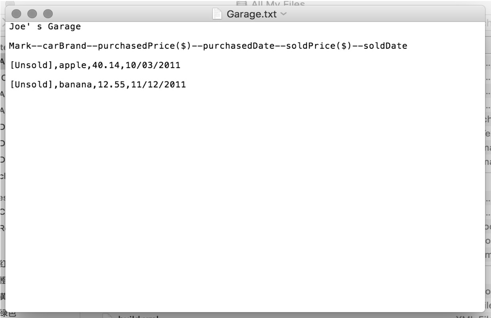
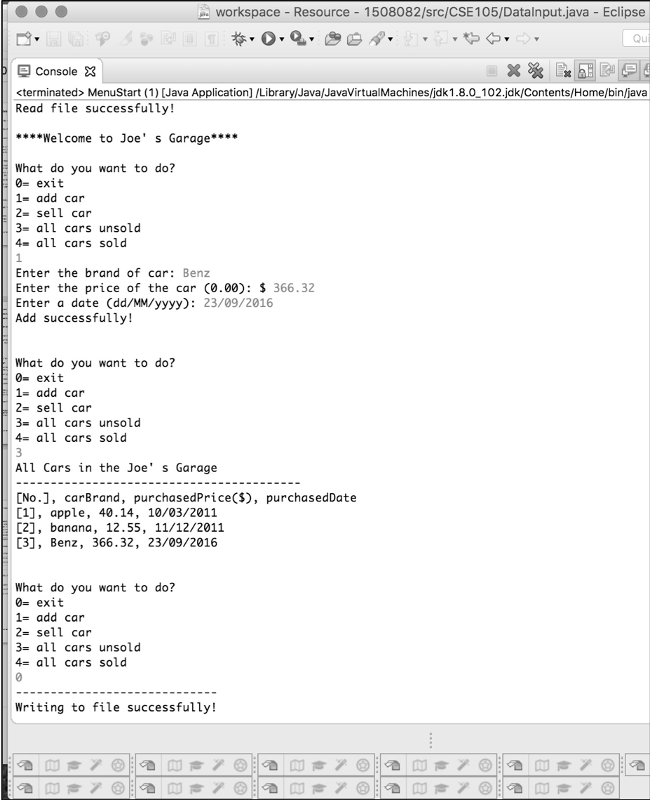
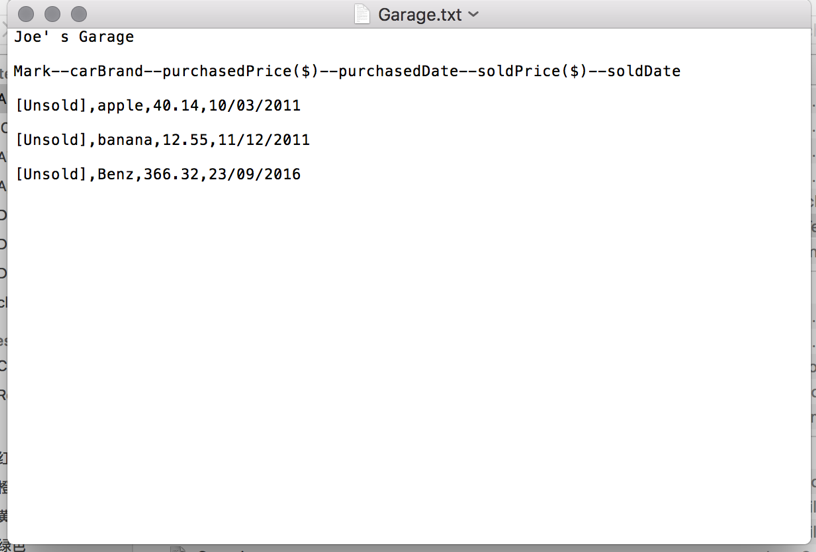
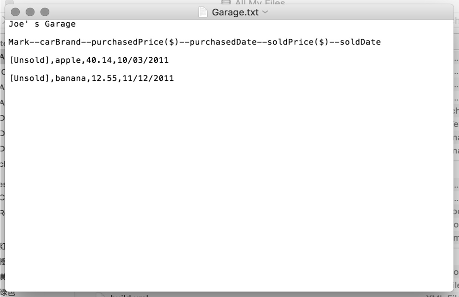
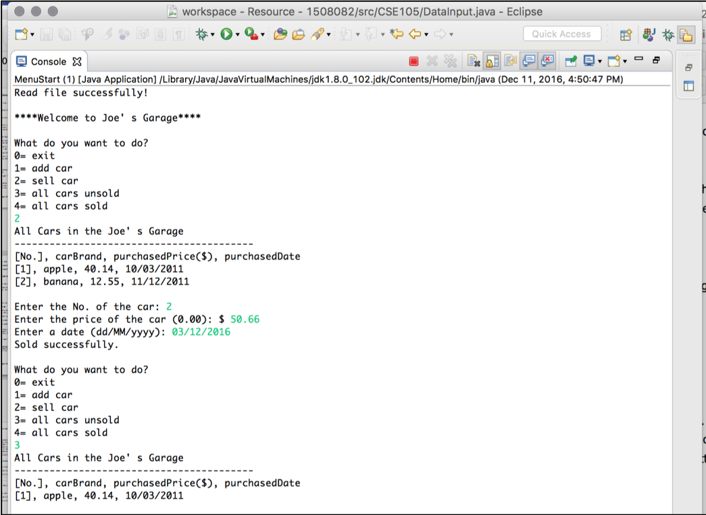
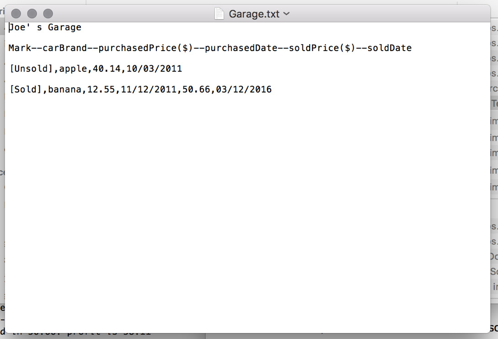
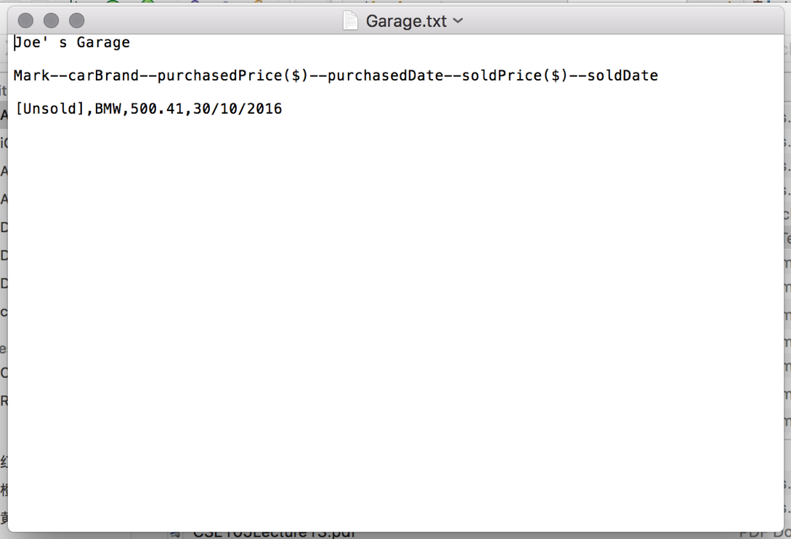

# Car_Sale_System
## Testing 
### Test case 1
#### Pre-condition
- A “Garage.txt” text file exits before running the program. 
- The file contained the data of 2 unsold cars.
#### Input (keyboard)
- Number of the operations provided by menu
- The brand, price of purchase and date of purchase of the car
#### Expected result
- Car is added to the garage.
- The information of 3 cars for sale in the garage is shown.
- Exit the program and the data of the new car has been written in file.
#### Screenshots

### Test case 2:
#### Pre-condition
- A “Garage.txt” text file exits before running the program. 
- The file contained the data of 2 unsold cars.
#### Input (keyboard)
- Number of the operations provided by menu
- The price of sale and date of sale of the car
- No. of the car the user want to sale
#### Expected result
- Car is removed from the garage.
- The sale report shows the information of 1 sold car.
- The information of 1 car for sale in the garage is shown.
- Exit the program and the data of sale has been written in file.
#### Screenshots

### Test case 3
#### Pre-condition
- A “Garage.txt” text file dose not exits before running the program. 
#### Input (keyboard)
- Number of the operations provided by menu
- The brand, price of purchase and date of purchase of the car
#### Expected result
- Car is added to the garage.
- The information of the new cars for sale in the garage is shown.
- Exit the program and a new text file named “Garage.txt” has been created
- The data of the new car has been written in file.
#### Screenshots

